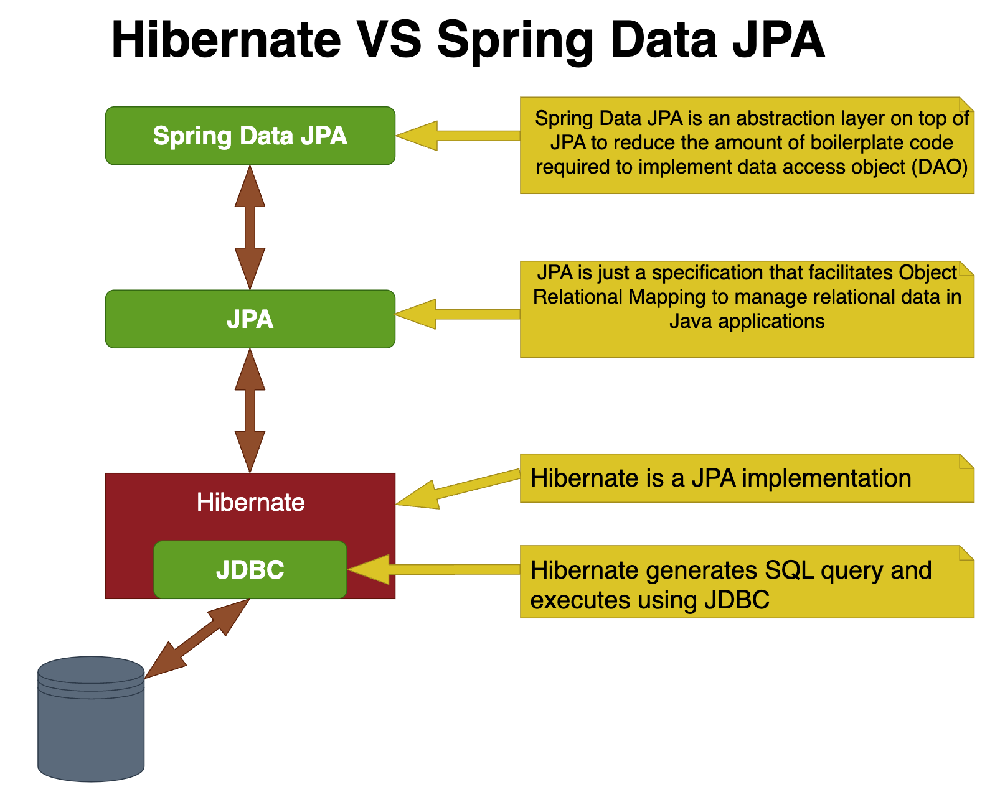
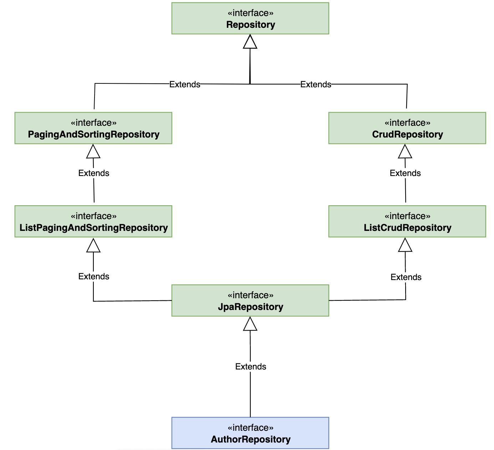
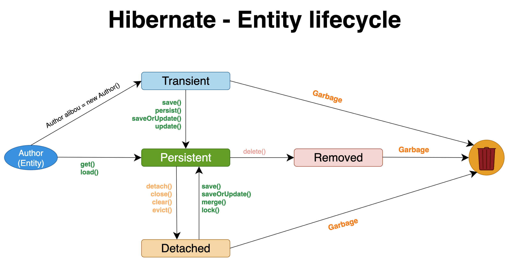
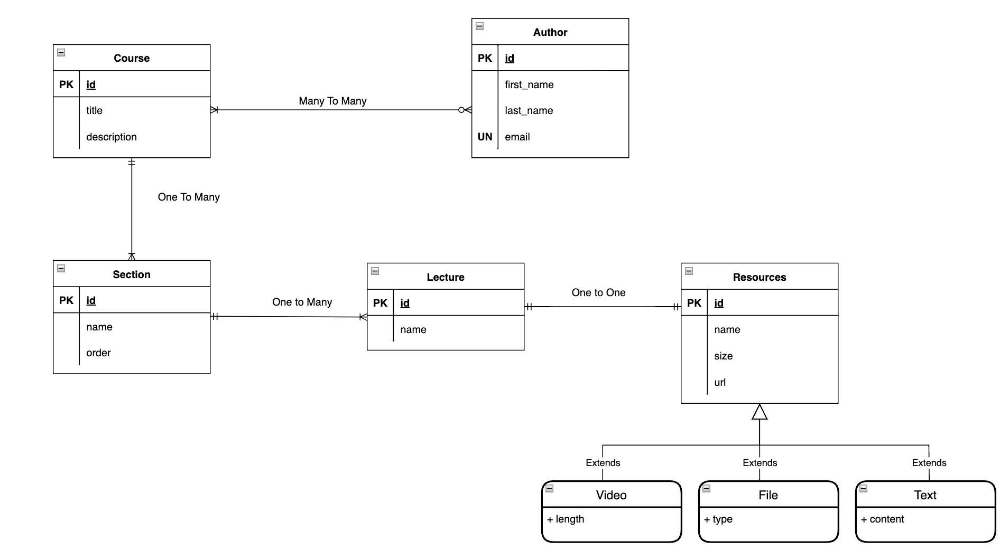

# Spring Data Jpa


## Table of Contents

- [Introduction](#introduction)
- [Spring Data JPA](#spring-data-jpa-1)
- [JPA](#jpa)
- [Hibernate Lifecycle](#hibernate-lifecycle)
- [Project DataBase Class Diagram ](#project-database-class-diagram)
- [Setup and Installation](#setup-and-installation)


## Introduction

Comprehensive Guide to Spring Data JPA, JPA, and Hibernate.




## Spring Data JPA

Spring Data JPA is part of the Spring Data family and provides a repository-based abstraction for data access.
It makes it easy to implement JPA-based repositories with minimal code.



### Key Features of Spring Data JPA


1. **Repositories**
    - Interface-based repository support with CRUD operations.
    - `CrudRepository`, `JpaRepository`, `PagingAndSortingRepository`.

2. **Query Methods**
    - Method naming conventions for query creation.
    - `findBy`, `findAll`, `countBy`, etc.

3. **Custom Queries**
    - Support for JPQL, native SQL, and query derivation from method names.

### Example Repository
   
```java
public interface UserRepository extends JpaRepository<User, Long> {
    List<User> findByLastName(String lastName);
}

```


## JPA

Java Persistence API (JPA) is a specification for accessing, persisting, and managing data between Java objects/classes and a relational database. JPA is a standard specification, and it requires an implementation to work, such as Hibernate, EclipseLink, or OpenJPA.

### JPA Annotations

- `@Entity`: Specifies that the class is an entity.
- `@Table`: Specifies the table in the database.
- `@Id`: Specifies the primary key.
- `@GeneratedValue`: Specifies the generation strategy for the primary key.
- `@Column`: Specifies the column in the table.


## Hibernate Lifecycle

Hibernate is an ORM (Object-Relational Mapping) tool that simplifies the interaction between Java applications and relational databases. Understanding the Hibernate lifecycle is crucial for effectively using Hibernate in your project.




### Hibernate Lifecycle States

1. **Transient State**
    - An object is in a transient state when it is instantiated using the `new` operator and is not associated with a Hibernate session.
    - It is not saved in the database and does not have a database identifier.

2. **Persistent State**
    - An object enters the persistent state when it is associated with a Hibernate session.
    - It is saved in the database, and any changes made to the object are synchronized with the database.
    - It can be achieved using methods like `session.save()`, `session.persist()`, or `session.update()`.

3. **Detached State**
    - An object is in a detached state when the Hibernate session is closed, and the object is no longer associated with any session.
    - Changes made to a detached object are not automatically synchronized with the database.
    - You can reattach a detached object to a session using methods like `session.merge()` or `session.update()`.

4. **Removed State**
    - An object is in the removed state when it is marked for deletion but the deletion is not yet reflected in the database.
    - This can be done using the `session.delete()` method.

## Project DataBase Class Diagram




## Setup and Installation
Provide instructions on how to set up and install your project. This can include:

- Prerequisites (e.g., JDK, Maven/Gradle)
- Cloning the repository
- Setting up the database
- Running the application.


